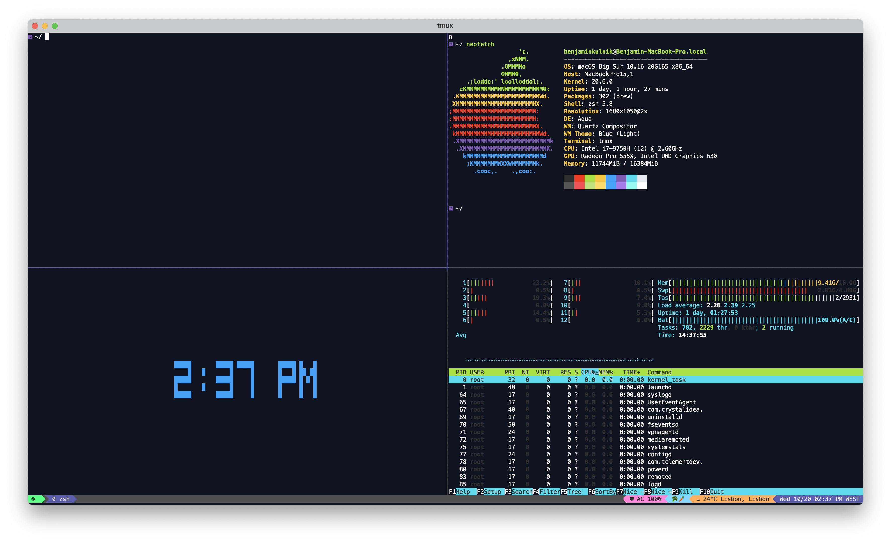

# Dotfiles

A backup of my dotfiles. Based on [michaeljsmalley/dotfiles](https://github.com/michaeljsmalley/dotfiles).

## Usage

Homebrew (or Linuxbrew on Linux) must already be installed. Clone the repository to `~/dotfiles` then run the `makesymlinks.sh` script. This will then:

1. Backup any existing files in `~` with the same name to `~/dotfiles_old`
2. Symlink the specified files from `~/dotfiles` to `~` (and `~/.config`)
3. Install `zsh` (via `apt`/`yum` on Linux, or point you at `brew install zsh` on macOS) and set it up with `oh-my-zsh`
4. Install any of the CLI tools below that are missing, via Homebrew

The script is safe to re-run: existing correct symlinks, an already-installed shell, and already-installed packages are all left untouched.

## List of installed services

- [oh-my-zsh](http://github.com/robbyrussell/oh-my-zsh.git)
- [ZSH Autosuggestions](https://github.com/zsh-users/zsh-autosuggestions)
- [Powerlevel10k](https://github.com/romkatv/powerlevel10k.git)
- [Tmux plug-in manager](https://github.com/tmux-plugins/tpm)
- [Tmux](https://github.com/gpakosz/.tmux)

## CLI dependencies (installed via Homebrew)

`starship`, `direnv`, `zoxide`, `mcfly`, `eza`, `bat`, `bun`, `ripgrep`, `gh`, `herdr`

## Credit

Credit for the `makesymlinks` script goes to [michaeljsmalley](https://github.com/michaeljsmalley/dotfiles).

## Information & Help

Information about the ZSH on the [ubuntuusers.de (german)](https://wiki.ubuntuusers.de/Zsh/)
